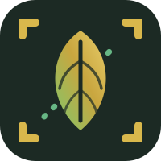
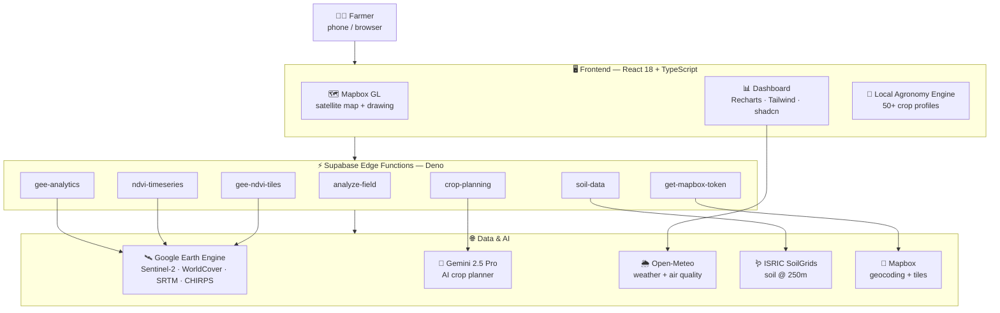
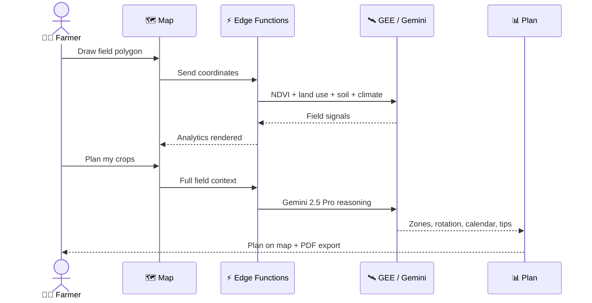

# 🌾 AgriSense

### See your field's future from space.

**Draw your land. Sense its health. Plan your harvest. All in one place.**

> **Submission for NextStep Hacks 2026** — theme: **Earth Forward** 🌍
> Sustainable agriculture meets satellite intelligence.

---

## 🌱 Inspiration

Food is the most human problem there is — and the least visible.

Most farmers never see their crop stress until it's too late. The data that could warn them — satellite NDVI, soil chemistry, climate history — already exists, floating above every field on Earth. But it's locked in tools built for researchers: GIS suites, raw APIs, dashboards that need a data-science degree to read.

We asked a simple question:

> **What if a farmer with nothing but a phone could draw their field on a map — and in seconds get the same intelligence that big agribusiness pays thousands for?**

That question became AgriSense.

Earth Forward is about using technology to protect the planet. We chose to protect the people who feed it.

---

## 🌍 The Problem

Agriculture is being squeezed from every side:

- 📉 **Losses stay hidden.** Drought, nutrient gaps, disease — invisible on the ground until the harvest fails.
- 🛰️ **Satellite intelligence is gated.** NDVI, soil profiles, climate records exist, but in formats farmers can't touch.
- 💸 **Expertise doesn't scale.** 500M+ smallholder farms grow a third of the world's food — most have never spoken to an agronomist.
- 🌡️ **Climate is shifting.** What worked last year may fail this year. Guessing is a luxury no one can afford.

## 💡 The Solution

**AgriSense turns any phone or laptop into a satellite-powered agronomist.**

You draw your field. Seconds later you see:

| 📡 Input | 🧠 What AgriSense tells you |
|---------|-----------------------------|
| 🗺️ Your field polygon | NDVI vegetation health from orbit |
| 🛰️ Sentinel-2 imagery | Is your crop thriving or stressed — today |
| 🪱 ISRIC SoilGrids | pH, carbon, nitrogen, texture, water retention |
| 🌦️ Open-Meteo | 12 months of rain + temperature + air quality |
| 🏞️ ESA WorldCover | Land use breakdown + suitability score |
| 🤖 Gemini 2.5 Pro | A full crop plan — zones, rotation, calendar, tips |

The answer isn't a chart. It's a plan: **what to plant, where, and when** — with a PDF to take to the field.

---

## ✨ What it does

- 🖊️ **Draw your field** on a live satellite map — one polygon, done.
- 🌿 **Reads vegetation health** via NDVI from Sentinel-2 at 10m resolution.
- 🪱 **Profiles the soil** — pH, organic carbon, nitrogen, CEC, texture, water retention.
- 🌦️ **Pulls climate history** — a full year of precipitation, temperature, evapotranspiration.
- 🌬️ **Monitors air quality** — AQI, PM2.5, PM10.
- 🏞️ **Classifies land use** and scores suitability on six axes.
- 🤖 **Generates an AI crop plan** — zone allocation, intercropping pairs, a 3-season rotation calendar, expert tips.
- 🗺️ **Draws the plan on your map** — every crop is a dot; trees are bigger dots.
- 📄 **Exports a PDF** you can carry into the field.
- 🛡️ **Knows when *not* to plan** — blocks lakes, deserts, polar zones, high altitude, cities.

---

## 📸 Demo

> A real walkthrough — a 9.1-acre wheat farm in Lahore, Pakistan.

<table>
<tr>
<td width="50%"></td>
<td width="50%"></td>
</tr>
<tr>
<td align="center"><b>🖊️ Draw your field</b> One polygon. That's all it takes.</td>
<td align="center"><b>🌦️ Climate history, instantly</b> Rain, temperature, evapotranspiration — a full year.</td>
</tr>
<tr>
<td width="50%"></td>
<td width="50%"></td>
</tr>
<tr>
<td align="center"><b>📊 Full analytics dashboard</b> NDVI, land use, suitability, air & water quality.</td>
<td align="center"><b>🤖 AI crop plan, on the map</b> Every dot is a plant — wheat, tomato, eucalyptus.</td>
</tr>
<tr>
<td width="50%"></td>
<td width="50%"></td>
</tr>
<tr>
<td align="center"><b>🥧 Zone allocation + impact</b> Wheat 35% · Walnut 33% · Maize 32% → 26% water saved, +24% revenue.</td>
<td align="center"><b>📅 3-season crop calendar + tips</b> Spring, summer, autumn/winter — with expert advice.</td>
</tr>
</table>

---

## 🏗️ How we built it

### 🔄 From field to plan

### 🧰 Tech Stack

| Layer | Tech | Why we chose it |
|------|------|-----------------|
| 🖥️ **Frontend** | React 18 · TypeScript 5 · Vite 5 | Type-safe, fast, mobile-first |
| 🎨 **UI** | Tailwind CSS 3 · shadcn/ui · Radix | Accessible, beautiful, consistent |
| 🗺️ **Mapping** | Mapbox GL JS 3 | Smooth satellite rendering + drawing tools |
| 📊 **Charts** | Recharts | NDVI curves, climate, soil, suitability radar |
| 🔄 **State** | TanStack React Query 5 | Caching + resilience on poor networks |
| ⚡ **Backend** | Supabase Edge Functions (Deno) | Serverless, close to the user |
| 🛰️ **Satellite** | Google Earth Engine | Sentinel-2 · ESA WorldCover · SRTM · CHIRPS |
| 🤖 **AI** | Gemini 2.5 Pro | Field-context-aware crop planning |
| 🌦️ **Weather** | Open-Meteo | Forecast + 1-year archive + air quality |
| 🪱 **Soil** | ISRIC SoilGrids | Global soil @ 250m resolution |
| 📄 **Export** | jsPDF | One-click crop plan PDF |

---

## 🧗 Challenges we ran into

- 🗺️ **Drawing on a satellite map is harder than it looks.** Freehand polygons need vertex editing, undo, escape handling, and mobile touch support. We built a custom draw state machine on Mapbox GL.
- 🛰️ **Google Earth Engine is powerful but opinionated.** Quotas, tile expiry, async computation — we wrapped GEE behind edge functions that cache and retry, so the frontend never has to care.
- 🤖 **LLMs hallucinate crops.** Gemini will happily suggest rice in the Sahara. So we built a *dual-engine*: a deterministic local agronomy scorer (50+ crop profiles) runs instantly, and Gemini's output is validated against hard edge-case rules before it ever reaches the user.
- 🌐 **Global means edge cases.** Planning crops on a lake, a glacier, a 5000m peak, or a city block? We built explicit guards so AgriSense says *"not here"* instead of producing nonsense.
- 📱 **Farmers use phones, not desktops.** The whole flow — draw, analyze, plan — works one-handed on a 6-inch screen.

## 📚 What we learned

- 🛰️ **Earth observation is a design problem**, not just a data problem. The best NDVI number in the world is useless if a farmer can't read it.
- 🤝 **AI + rules beats AI alone.** Pairing a deterministic agronomy engine with Gemini gave us plans that are both fast *and* trustworthy.
- 🌍 **The planet's data is freer than we thought.** Sentinel-2, SoilGrids, Open-Meteo, WorldCover — world-class data, zero cost. The missing piece was the interface.
- 🧩 **Serverless edge functions are a hackathon superpower** — eight focused Deno functions, no ops, deploys in seconds.

## 🏆 Accomplishments we're proud of

- ✅ **A complete, working product** — from polygon to PDF in under a minute.
- 🤖 **AI plans with real numbers** — the sample plan shows **26% water saved** and **+24% revenue**.
- 🧠 **An AI system with guardrails** — dual-engine planning with hard edge-case validation.
- 🌍 **It works anywhere on Earth** — truly global coverage from day one.
- 💚 **Zero-cost data stack** — Open-Meteo + SoilGrids + Sentinel-2 mean this stays free for the people who need it most.

## 🚀 What's next

- 🌾 **Multi-field farms** — plan rotations across a whole operation, not one field.
- 📡 **Live alerts** — "your NDVI dropped this week" push notifications.
- 🌱 **Pest & disease early warning** from spectral anomalies.
- 🗣️ **Offline mode + local languages** — for the fields with no signal.
- 🤝 **Partnerships** with local agricultural extension programs.

---

## 🌱 Why Earth Forward

| UN SDG | How AgriSense contributes |
|--------|---------------------------|
| 🎯 **SDG 2** — Zero Hunger | Higher yields through smarter crop choices |
| 💧 **SDG 6** — Clean Water | 26% water savings in the sample plan |
| 🌍 **SDG 13** — Climate Action | Climate-resilient rotation planning |
| 🌾 **SDG 12** — Responsible Production | Right crop, right place — less waste |

> AgriSense puts satellite intelligence in the hands of the people who need it most — small farmers, students, and communities — for free.

---

## 🔗 Links

| | |
|---|---|
| 💻 **Code** | https://github.com/theyapguard/AgriSense |
| 📖 **README** | Full technical docs in the repo |
| 🎥 **Demo video** | *(attach your 5-min pitch)* |

---

## 📝 Disclosure — what was built when

Per hackathon rules, transparency on prior work:

- **Before the hackathon:** the project's technical foundation — the mapping, analytics, and backend architecture — had been explored in earlier iterations.
- **During this hackathon:** rebranding to **AgriSense**, new visual identity + logo, full README + this Devpost write-up, architecture documentation, and end-to-end polish for the Earth Forward submission.

---

**AgriSense** — because every field deserves a plan. 🌾

Made with 🛰️, 🤖, and ❤️ for the Earth.

