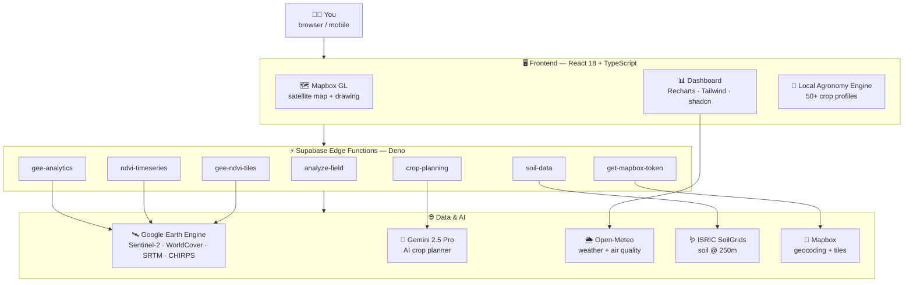
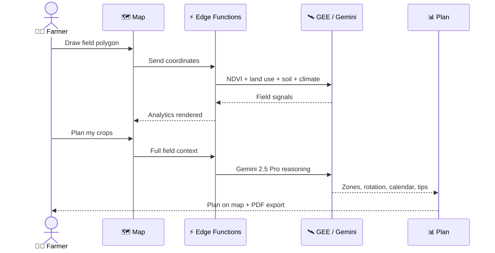

<div align="center">


# 🌾 AgriSense

### See your field's future from space.

**Draw your land. Sense its health. Plan your harvest. All in one place.**

[](https://github.com/theyapguard/AgriSense)
[](LICENSE)
[](https://github.com/theyapguard/AgriSense/issues)

<br>

[](https://react.dev)
[](https://www.typescriptlang.org)
[](https://vite.dev)
[](https://tailwindcss.com)
[](https://www.mapbox.com)
[](https://supabase.com)
[](https://earthengine.google.com)
[](https://deepmind.google/technologies/gemini)
[](https://sentinels.copernicus.eu)

</div>

---

## 🌍 The Problem

Agriculture feeds the world, yet most farmers still make decisions in the dark.

- 📉 **Yield losses are invisible until it's too late.** Stress, drought, nutrient gaps — by the time you see them on the ground, the season is gone.
- 🛰️ **Satellite intelligence is locked away.** NDVI, soil data, climate history all exist — but they live in tools built for scientists, not growers.
- 💸 **Smallholders can't afford agronomists.** 500M+ small farms grow a third of the world's food, and most have no access to expert planning.
- 🌱 **Climate change is rewriting the rules.** Last year's plan doesn't work this year. Guessing is expensive.

## 💡 Our Solution

**AgriSense turns any phone or laptop into a satellite-powered agronomist.**

Draw your field on the map. Within seconds, you get what used to take weeks: vegetation health from orbit, the soil under your feet, the weather above it, and an AI-generated crop plan that tells you **what to plant, where, and when** — with the numbers to back it up.

<table>
<tr>
<td width="50%">

### 🎯 What AgriSense does

- 🗺️ Draw fields on a live satellite map
- 🌿 Read vegetation health (NDVI) from Sentinel-2
- 🪱 Profile soil — pH, carbon, nitrogen, texture, water retention
- 🌦️ Pull 12 months of climate history + live air quality
- 🏞️ Classify land use and score suitability
- 🤖 Generate an AI crop plan with zones, intercropping, rotation
- 📄 Export the plan as a PDF

</td>
<td width="50%">

### 🚀 Why it wins

- ⚡ **Instant** — no signup walls, no installs
- 🆓 **Free to run** — Open-Meteo & SoilGrids need no keys
- 🌐 **Works anywhere on Earth** — global satellite coverage
- 🧠 **AI + rules** — a local agronomy engine plus Gemini 2.5 Pro
- 📱 **Mobile-first** — built for the field, not just the desk

</td>
</tr>
</table>

---

## 📸 Demo

> A real walkthrough — a 9.1-acre wheat farm in Lahore, Pakistan.

<table>
<tr>
<td width="50%"></td>
<td width="50%"></td>
</tr>
<tr>
<td align="center"><b>🖊️ Draw your field</b><br>One polygon. That's all it takes.</td>
<td align="center"><b>🌦️ Climate history, instantly</b><br>Rain, temperature, evapotranspiration — a full year.</td>
</tr>
<tr>
<td width="50%"></td>
<td width="50%"></td>
</tr>
<tr>
<td align="center"><b>📊 Full analytics dashboard</b><br>NDVI, land use, suitability, air & water quality.</td>
<td align="center"><b>🤖 AI crop plan, on the map</b><br>Every dot is a plant — wheat, tomato, eucalyptus, placed for you.</td>
</tr>
<tr>
<td width="50%"></td>
<td width="50%"></td>
</tr>
<tr>
<td align="center"><b>🥧 Zone allocation + impact</b><br>Wheat 35% · Walnut 33% · Maize 32% → 26% water saved, +24% revenue.</td>
<td align="center"><b>📅 3-season crop calendar + tips</b><br>Spring, summer, autumn/winter — planned with expert advice.</td>
</tr>
</table>

---

## ✨ Key Features

### 🛰️ Satellite Field Mapping
- Interactive Mapbox GL satellite map with polygon drawing
- Live NDVI overlay from Google Earth Engine
- Auto-detection of rural vs urban regions
- Fly-to animations, region search, side-by-side field comparison

### 🌿 NDVI Vegetation Health
Sentinel-2 imagery processed through GEE into NDVI — the gold standard for crop health.

```
NDVI = (NIR - Red) / (NIR + Red)
```

| NDVI | Meaning | Status |
|-----:|---------|:------:|
| `< 0.2` | Bare soil / critical | 🔴 |
| `0.2 – 0.4` | Stressed | 🟠 |
| `0.4 – 0.6` | Moderate | 🟡 |
| `> 0.6` | Healthy | 🟢 |

### 🪱 Soil Science (ISRIC SoilGrids, 250m)
Full pedological profile: pH, organic carbon, nitrogen, CEC, bulk density, sand/silt/clay texture, field capacity, wilting point — visualized.

### 🏞️ Land Use + Suitability
ESA WorldCover 10m classification + a 6-axis suitability radar: soil, water, climate, topography, drainage, nutrients.

### 🤖 AI Crop Planning
- **Local agronomy engine** — 50+ crop profiles scored against your field's signals, instantly.
- **Gemini 2.5 Pro planner** — full-field context, native-plant enforcement, zone allocation, intercropping, rotation, expert tips.
- **Visual plan** — every crop is a dot on your real field. Trees get bigger dots. Filter by crop.

### 🛡️ Smart Edge-Case Detection
We don't plan crops on a lake. Or a glacier.

| Blocked when | Threshold |
|--------------|-----------|
| 🌊 Water bodies | ≥ 80% water (WorldCover) |
| 🏜️ Extreme desert | < 50mm annual rain (CHIRPS) |
| ❄️ Polar | > 66° latitude |
| ⛰️ High altitude | > 5000m elevation |
| 🏙️ Urban | ≥ 30% built-up → switches to urban mode |

---

## 🏗️ Architecture



### 🔄 How a field becomes a plan



---

## 🧰 Tech Stack

| Layer | Tech | Why |
|------|------|-----|
| 🖥️ **Frontend** | React 18 · TypeScript 5 · Vite 5 | Type-safe and fast |
| 🎨 **UI** | Tailwind CSS 3 · shadcn/ui · Radix | Beautiful + accessible |
| 🗺️ **Mapping** | Mapbox GL JS 3 | Smooth 3D satellite rendering |
| 📊 **Charts** | Recharts | NDVI, climate, soil, suitability visuals |
| 🔄 **State** | TanStack React Query 5 | Smart caching, offline-friendly |
| ⚡ **Backend** | Supabase Edge Functions (Deno) | Serverless, low latency |
| 🛰️ **Satellite** | Google Earth Engine | Sentinel-2 · ESA WorldCover · SRTM · CHIRPS |
| 🤖 **AI** | Gemini 2.5 Pro | Context-aware crop planning |
| 🌦️ **Weather** | Open-Meteo | Forecast + 1-year archive + air quality |
| 🪱 **Soil** | ISRIC SoilGrids | Global soil @ 250m |
| 📄 **Export** | jsPDF | One-click crop plan PDF |

---

## 📁 Project Structure

```
AgriSense/
├── 🖥️ src/
│   ├── components/        # MapView · FieldDetailView · CropPlanningSection · WeatherView
│   │   └── ui/            # shadcn/ui primitives
│   ├── data/              # 50+ crop profiles · field types
│   ├── hooks/             # mobile · swipe · toast
│   ├── lib/               # language · backend callers · cache
│   ├── pages/             # Index · NotFound
│   └── integrations/      # supabase client
├── ⚡ supabase/functions/ # 8 Deno edge functions
├── 🌐 api/                # serverless API endpoints
├── 🎨 public/             # logo · favicons · demo screenshots
└── 🗄️ supabase/migrations/# database schema
```

---

## 🚀 Getting Started

### 1️⃣ Clone & install

```bash
git clone https://github.com/theyapguard/AgriSense.git
cd AgriSense
npm install
```

### 2️⃣ Configure secrets

```env
MAPBOX_TOKEN=               # Mapbox map + geocoding
GEE_SERVICE_ACCOUNT_JSON=   # Google Earth Engine key
GEE_PROJECT_ID=             # GCP project with EE enabled
GEMINI_API_KEY=             # Gemini 2.5 Pro
```

> 🆓 **Open-Meteo** and **ISRIC SoilGrids** are free public APIs — no key needed.

### 3️⃣ Run

```bash
npm run dev                # frontend
supabase functions serve   # edge functions
```

Open `http://localhost:5173` → draw a field → get your plan.

---

## 🌱 Impact — aligned with **Earth Forward**

| UN SDG | How AgriSense helps |
|--------|---------------------|
| 🎯 **SDG 2** — Zero Hunger | Higher yields through smarter crop choices |
| 💧 **SDG 6** — Clean Water | 26% water savings in the sample plan |
| 🌍 **SDG 13** — Climate Action | Climate-resilient rotation planning |
| 🌾 **SDG 12** — Responsible Production | Right crop, right place — less waste |

AgriSense puts satellite intelligence in the hands of the people who need it most — small farmers, students, and communities — for free.

---

## 🏆 Built for NextStep Hacks 2026

**Theme:** Earth Forward 🌍
**Challenge:** sustainable agriculture + climate resilience through technology
**Stack:** React · TypeScript · Google Earth Engine · Gemini 2.5 Pro · Mapbox · Supabase

---

## 📜 License

[MIT](LICENSE) — free to use, learn from, and build on.

<div align="center">

**AgriSense** — because every field deserves a plan. 🌾

<sub>Made with 🛰️, 🤖, and ❤️ for the Earth.</sub>

</div>
